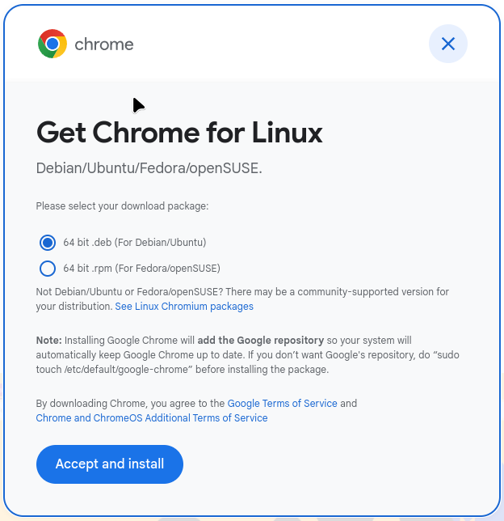
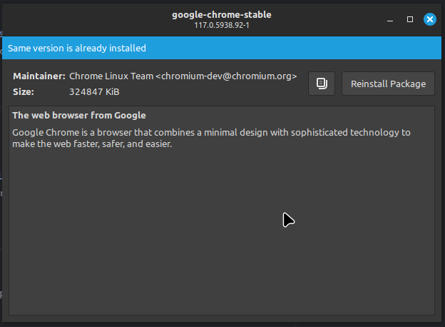

# Global Applications

**NOTE:** This is a good example of how some applications can be installed using `.deb` packages from various sources. 

## SSHD

If one wants to connect to the box remotely, openssh-server is not installed by default. 

```shell
sudo apt install openssh-server molly-guard monkeysphere ssh-askpass monkeysphere-validation-agent
```

**NOTE:** Key pairs we will configure later.

## GitHub CLI Client

NOTE: Package `GH` exists in Ubuntu repository, however, it's outdated. <br/>
Use [these instructions to install the current version](https://github.com/cli/cli/blob/trunk/docs/install_linux.md) from GitHub package repository.

Here is the snippet from the instructions:

```shell
type -p curl >/dev/null || (sudo apt update && sudo apt install curl -y)
curl -fsSL https://cli.github.com/packages/githubcli-archive-keyring.gpg | sudo dd of=/usr/share/keyrings/githubcli-archive-keyring.gpg \
&& sudo chmod go+r /usr/share/keyrings/githubcli-archive-keyring.gpg \
&& echo "deb [arch=$(dpkg --print-architecture) signed-by=/usr/share/keyrings/githubcli-archive-keyring.gpg] https://cli.github.com/packages stable main" | sudo tee /etc/apt/sources.list.d/github-cli.list > /dev/null \
&& sudo apt update \
&& sudo apt install gh -y
```

This will add a source manifest in `/etc/apt/sources.list.d/github-cli.list`

```
deb [arch=amd64 signed-by=/usr/share/keyrings/githubcli-archive-keyring.gpg] https://cli.github.com/packages stable main
```

## Google Chrome Browser

Navigate to https://www.google.com/chrome/ and download your DEB package. Double-click in Downloads to install using graphical package manager that will open automatically.



NOTE: This image shows that package already installed is tracked natively.



Chrome installer will add its own sources manifest. By now we have three:


Contents of `/etc/apt/sources.list.d/google-chrome.list`

```
### THIS FILE IS AUTOMATICALLY CONFIGURED ###
# You may comment out this entry, but any other modifications may be lost.
deb [arch=amd64] https://dl.google.com/linux/chrome/deb/ stable main
```